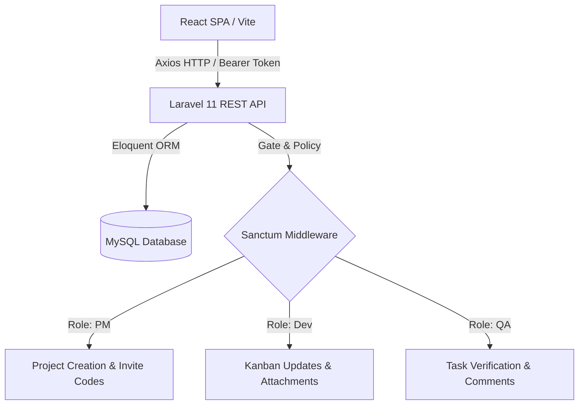
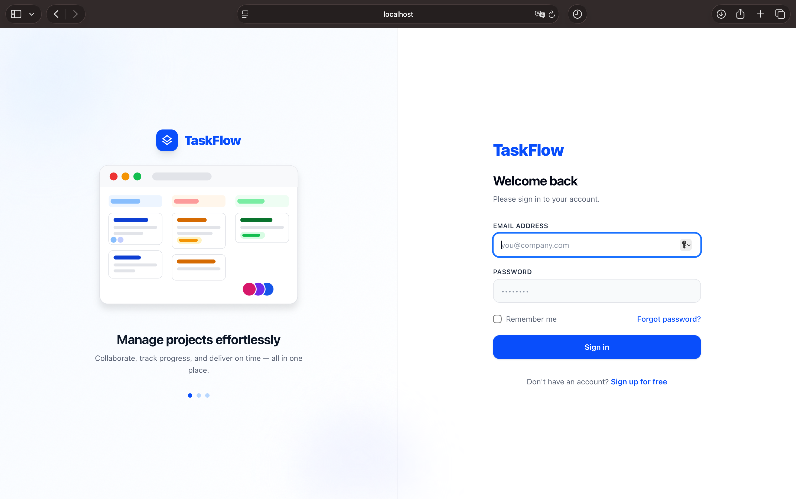
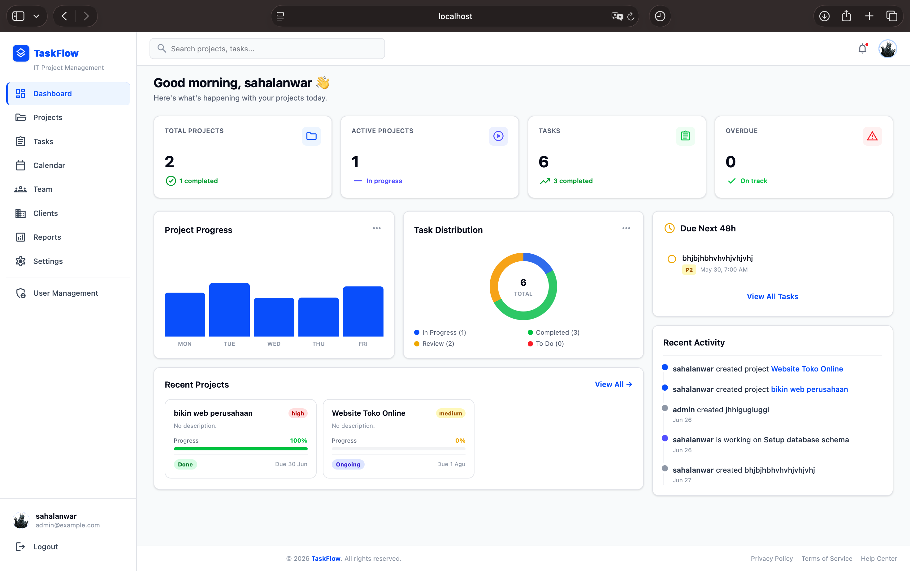
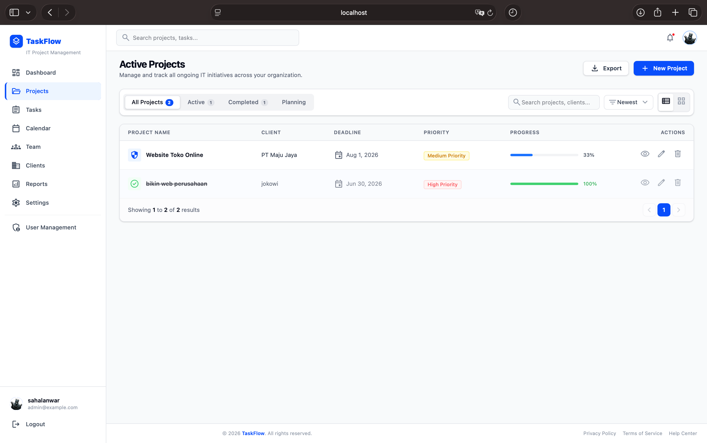
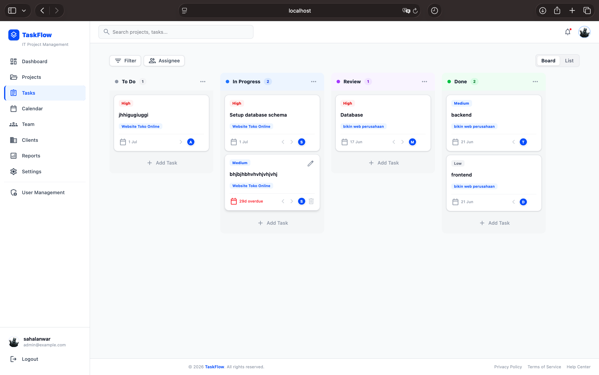
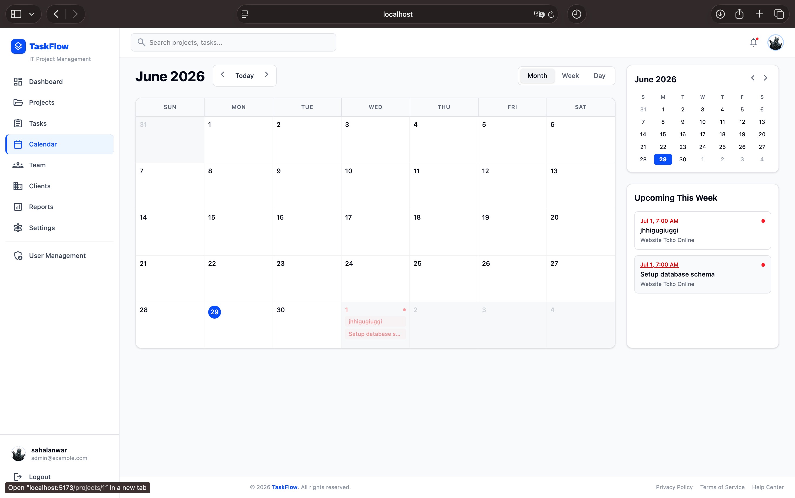
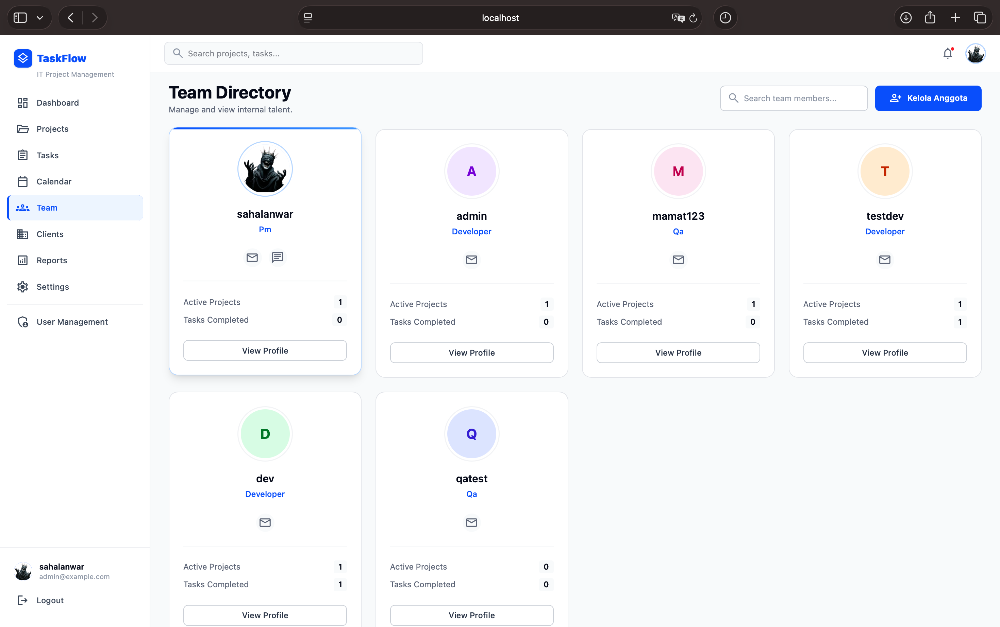
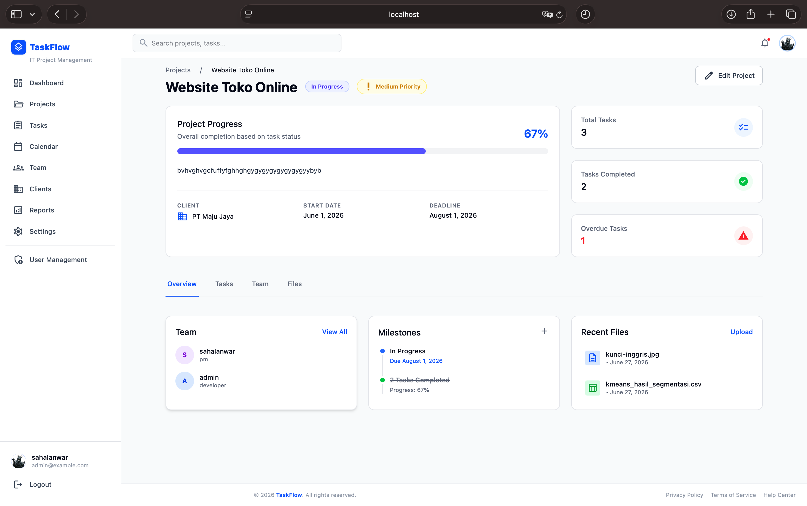
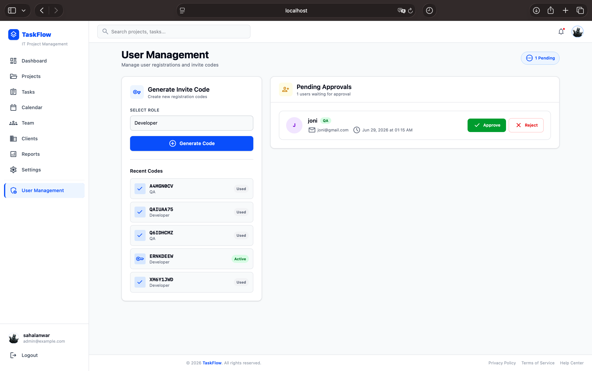

<div align="center">


# 🚀 TaskFlow

**Sistem Manajemen Proyek & Tugas IT yang Terintegrasi dan Kolaboratif**

[](LICENSE)


<p align="center">
  <a href="#--overview">Overview</a> •
  <a href="#--features">Features</a> •
  <a href="#--tech-stack">Tech Stack</a> •
  <a href="#--getting-started">Installation</a> •
  <a href="#--api-reference">API Docs</a> •
  <a href="#--screenshots">Screenshots</a> •
  <a href="#--developer-information">Developer</a>
</p>

</div>

---

## 📖 Overview

**TaskFlow** adalah aplikasi manajemen proyek berbasis web modern yang dirancang untuk memfasilitasi kolaborasi siklus pengembangan perangkat lunak (SDLC) antara **Project Manager (PM)**, **Developer**, dan **Quality Assurance (QA)**. 

Dibangun menggunakan arsitektur *Decoupled* (**Laravel 11** sebagai Headless REST API dan **React.js** sebagai Single Page Application), TaskFlow memecahkan masalah fragmentasi komunikasi dengan menyatukan pelacakan progres tugas (*Kanban*), diskusi instruksional, dan manajemen berkas dalam satu platform sentral.

---

## ✨ Features

- [x] **Secure Authentication** — Autentikasi token berlapis menggunakan *Laravel Sanctum*.
- [x] **Role-Based Access Control (RBAC)** — Hak akses eksklusif yang membedakan kapabilitas PM, Dev, dan QA.
- [x] **Closed Onboarding System** — Registrasi anggota tim diamankan menggunakan sistem *Unique Invite Code*.
- [x] **Interactive Kanban Board** — Visualisasi alur kerja (*To Do, In Progress, Review, Done*) secara dinamis.
- [x] **Task Thread Discussions** — Resolusi masalah dan revisi langsung pada kartu tugas terkait.
- [x] **File Attachments** — Pendukung lampiran dokumen spesifikasi maupun bukti *bug*.
- [x] **Executive Dashboard** — Kalkulasi metrik produktivitas tim dan kalender tenggat waktu terintegrasi.

---

## 📐 System Architecture



---

## 🛠 Tech Stack

| Layer | Technology | Version | Description |
| :--- | :--- | :---: | :--- |
| **Frontend** | React.js | v18 | Core SPA Library |
| **State/Build**| Vite | v8 | Next-generation Frontend Tooling |
| **Styling** | Tailwind CSS | v3 | Utility-first CSS Framework |
| **Backend** | Laravel | v11 | PHP Core Framework |
| **Auth** | Laravel Sanctum| v4 | Featherweight API Authentication |
| **Database** | MySQL | v8.0+ | Relational Database Management |

---

## 📂 Folder Structure

```text
📦 project_pemrograman_web
 ┣ 📂 Backend                 # Headless Laravel API
 ┃ ┣ 📂 app
 ┃ ┃ ┣ 📂 Http/Controllers/Api
 ┃ ┃ ┗ 📂 Models
 ┃ ┣ 📂 database
 ┃ ┃ ┣ 📂 migrations
 ┃ ┃ ┗ 📜 db_task_m_2026-06-29.sql
 ┃ ┗ 📜 .env.example
 ┗ 📂 frontend                # React Vite SPA
   ┣ 📂 src
   ┃ ┣ 📂 api
   ┃ ┣ 📂 DashboardLayout     
   ┃ ┣ 📂 pages
   ┃ ┗ 📜 App.jsx
   ┗ 📜 package.json
```

---

## 🚀 Getting Started

Ikuti langkah di bawah ini untuk menjalankan repositori di lingkungan lokal (*Localhost*).

### Prasyarat
* PHP >= 8.2 & Composer
* Node.js >= 18.x & npm
* MySQL Server

### 1. Clone Repository
```bash
git clone https://github.com/username-kamu/project_pemrograman_web.git
cd project_pemrograman_web
```

### 2. Setup Backend (Laravel)
```bash
cd Backend
composer install
cp .env.example .env
php artisan key:generate

# Konfigurasi database di file .env Anda, lalu jalankan:
php artisan migrate
php artisan storage:link
php artisan serve
```

### 3. Setup Frontend (React)
```bash
cd frontend
npm install
npm run dev
```

---

## 🔐 Environment Variables

### Backend (`Backend/.env`)
```ini
DB_CONNECTION=mysql
DB_HOST=127.0.0.1
DB_PORT=3306
DB_DATABASE=taskflow_db
DB_USERNAME=root
DB_PASSWORD=

FRONTEND_URL=http://localhost:5173
```

### Frontend (`frontend/.env`)
```ini
VITE_API_URL=http://localhost:8000/api
```

---

## 💾 Database Setup

Import berkas cadangan database secara manual jika tidak menggunakan sistem migrasi:

```bash
mysql -u root -p taskflow_db < Backend/database/db_task_m_2026-06-29.sql
```

### 🔑 Default Admin Account

Setelah database berhasil di-*import* atau di-*seed*, gunakan kredensial berikut untuk login pertama kali sebagai **Project Manager (Admin)**:

| Field | Value |
| :--- | :--- |
| **Email** | `admin@example.com` |
| **Password** | `admin123` |

> ⚠️ **Catatan Keamanan:** Kredensial di atas hanya untuk keperluan demo/pengembangan lokal. Segera ubah password default setelah login pertama, dan jangan pernah menggunakan kredensial ini pada environment production.

---

## 📡 API Reference

| Method | Endpoint | Access | Description |
| :--- | :--- | :---: | :--- |
| `POST` | `/api/login` | Public | Autentikasi & penerbitan token |
| `POST` | `/api/register` | Public | Registrasi via kode undangan |
| `GET` | `/api/me` | Auth | Mengambil sesi current user |
| `GET` | `/api/projects` | Auth | Daftar seluruh proyek |
| `POST` | `/api/projects` | **PM** | Membuat proyek baru |
| `PUT` | `/api/tasks/{id}` | Auth | Pembaruan status pemindahan Kanban |
| `POST` | `/api/invite-codes`| **PM** | Generate kode invite baru |

---

## 📸 Screenshots

| Login Interface | Dashboard Analytics |
| :---: | :---: |
|  |  |
| **Projects List** | **Kanban Board** |
|  |  |
| **Schedule Calendar** | **Team Directory** |
|  |  |
| **Project Details** | **User Management** |
|  |  |

---

## 👨‍💻 Developer Information

<div align="center">

| Nama | NIM | Kelas |
| :---: | :---: | :---: |
| **Muhammad Sahal Anwar Hadi** | 24260032 | TI B Semester 4 |

</div>

<div align="center">
Proyek ini dikembangkan sebagai bagian dari tugas mata kuliah **Pemrograman Web**


</div>
---

<div align="center">

**Dibuat oleh Muhammad Sahal Anwar Hadi**
*NIM 24260032 — TI B Semester 4*

⭐️ Jangan lupa berikan star jika proyek ini bermanfaat!

</div>
