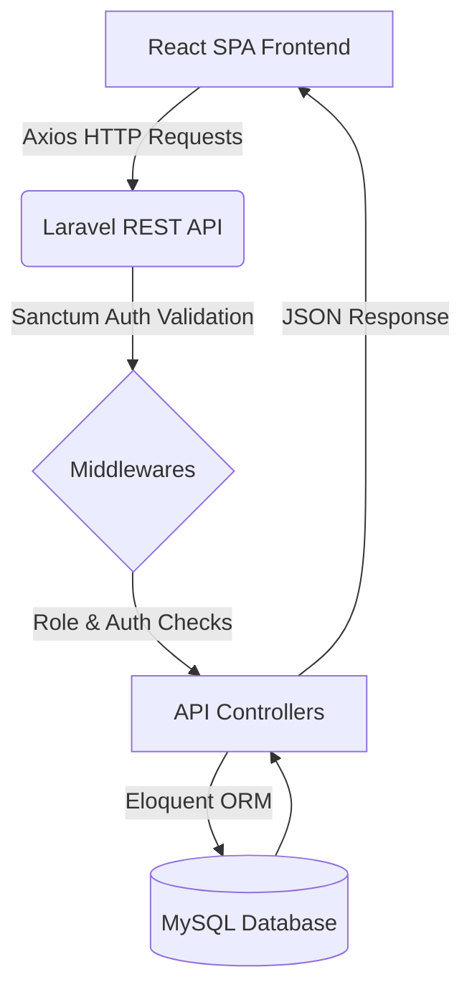

<div align="center">
  
  # 🚀 TaskFlow
  **The Ultimate IT Project & Task Management System**
  
  [](https://laravel.com)
  [](https://reactjs.org/)
  [](https://vitejs.dev/)
  [](https://tailwindcss.com/)
  [](https://www.mysql.com/)

  <br />

  

</div>

---

## 📖 Overview

**TaskFlow** is a modern, comprehensive IT Project and Task Management System designed to streamline software development workflows. Built with a robust **Laravel** backend and a blazing-fast **React (Vite)** frontend, it helps teams collaborate efficiently, track progress seamlessly, and deliver projects on time.

### The Business Problem
Managing software projects often involves scattered communication, lost files, and unclear role boundaries. TaskFlow brings structure by centralizing project tracking, task assignments, role-based access control, and team collaboration into one cohesive platform.

### Target Users
- **Project Managers (PM):** To oversee projects, assign tasks, approve new team members, and generate invite codes.
- **Developers:** To receive tasks, update task statuses (e.g., Todo -> In Progress -> Done), and collaborate via comments.
- **QA Engineers:** To review completed tasks, report issues, and verify fixes.

---

## ✨ Features

Based on the actual implementation in the repository, here are the available features:

### 🔐 Authentication & Authorization
* **Secure Login & Registration** (via Laravel Sanctum)
* **Invite-Code Registration:** Users register using specific codes generated by PMs that automatically assign their role.
* **User Approval System:** New accounts are placed in a 'pending' state until approved by a Project Manager.
* **Role-Based Access Control (RBAC):** Distinct permissions for `pm`, `developer`, and `qa`.
* **Profile Management:** Update profile details and upload avatars.
* **Change Password** functionality.

### 📁 Project Management (PM Only)
* **Create, Update, & Delete Projects**
* **Project Dashboard:** Overview of active, pending, and completed projects.
* **Project Attachments:** Upload and manage project-related files securely.
* **Project Status Tracking:** Mark projects as Todo, In Progress, Review, or Done.

### ✅ Task Management
* **Kanban-Style Task Tracking:** Visual board for tasks (Todo, In Progress, Review, Done).
* **Task Assignment:** Assign specific team members to tasks.
* **Priority Levels:** High, Medium, Low.
* **Due Dates:** Track overdue, upcoming, and completed tasks dynamically.
* **Role-Specific Task Updates:** 
  - Developers can only move tasks to "Review".
  - QA can move tasks to "Done" or revert to "Todo"/"In Progress".
  - PMs have full control.

### 💬 Collaboration & Team
* **Task Comments:** Real-time discussion threads on specific tasks.
* **User Management Dashboard:** PMs can view all users, manage pending approvals, and reject/approve accounts.
* **Invite Code Generation:** PMs generate role-specific codes (e.g., for new Developers or QA).
* **Team Directory:** View active team members and their roles.

### 📊 Reporting & Views
* **Dashboard Analytics:** High-level metrics for projects and tasks.
* **Calendar View:** Visualize upcoming task deadlines globally.
* **Reports:** Detailed task breakdown and project progress.

---

## 📸 Screenshots

| Login & Authentication | Dashboard Overview |
|:---:|:---:|
|  |  |

| Kanban Task Management | User Approvals (PM) |
|:---:|:---:|
|  |  |

*(Note: Replace placeholder image paths with actual screenshots inside the `docs/images/` directory)*

---

## 🛠 Technology Stack

| Category | Technology |
|---|---|
| **Frontend Framework** | React 18 |
| **Build Tool** | Vite |
| **Styling** | Tailwind CSS |
| **HTTP Client** | Axios |
| **Routing** | React Router DOM |
| **Backend Framework** | Laravel 11 (PHP) |
| **Authentication** | Laravel Sanctum |
| **Database** | MySQL / SQLite (configurable) |

---

## 🏗 Architecture

TaskFlow uses a decoupled SPA (Single Page Application) architecture:



---

## 📂 Folder Structure

```text
📦 project_pemrograman_web
 ┣ 📂 Backend                 # Laravel API
 ┃ ┣ 📂 app
 ┃ ┃ ┣ 📂 Http/Controllers/Api # API Controllers (Auth, Project, Task, etc.)
 ┃ ┃ ┗ 📂 Models               # Eloquent Models
 ┃ ┣ 📂 database
 ┃ ┃ ┣ 📂 migrations           # Schema definitions
 ┃ ┃ ┗ 📜 db_task_m_2026-06-29.sql # Database Backup Dump
 ┃ ┣ 📂 routes
 ┃ ┃ ┗ 📜 api.php              # RESTful Route definitions
 ┃ ┗ 📜 .env                   # Backend configuration
 ┗ 📂 frontend                # React + Vite Application
   ┣ 📂 src
   ┃ ┣ 📂 api                  # Axios configuration
   ┃ ┣ 📂 DasboardLayout       # Shared UI (Sidebar, Navbar, Layout)
   ┃ ┣ 📂 pages                # React Views (Login, Dashboard, Projects, etc.)
   ┃ ┣ 📜 App.jsx              # React Router setup
   ┃ ┗ 📜 index.css            # Tailwind directives
   ┗ 📜 package.json           # Frontend dependencies
```

---

## 💾 Database

A full SQL backup is provided in the repository for quick setup.
**Location:** `Backend/database/db_task_m_2026-06-29.sql`

To import the database manually:
```bash
mysql -u root -p your_database_name < Backend/database/db_task_m_2026-06-29.sql
```
*(Alternatively, you can run `php artisan migrate --seed` to generate fresh tables based on migrations).*

---

## 🚀 Installation Guide

Follow these steps to get the project running locally.

### 1. Backend (Laravel)
```bash
cd Backend

# Install PHP dependencies
composer install

# Copy environment file
cp .env.example .env

# Generate application key
php artisan key:generate

# Link storage (for profile photos & attachments)
php artisan storage:link
```

**Configure `.env`**:
Ensure your database credentials are correct in the `.env` file:
```env
DB_CONNECTION=mysql
DB_HOST=127.0.0.1
DB_PORT=3306
DB_DATABASE=taskflow_db
DB_USERNAME=root
DB_PASSWORD=
```

```bash
# Run migrations
php artisan migrate

# Start the Laravel development server
php artisan serve
```

### 2. Frontend (React)
Open a new terminal window:
```bash
cd frontend

# Install Node dependencies
npm install

# Start the Vite development server
npm run dev
```

The application will be accessible at `http://localhost:5173`.

---

## 🔑 Environment Variables

### Backend (`Backend/.env`)
Required variables:
- `APP_URL=http://localhost:8000`
- `FRONTEND_URL=http://localhost:5173` (Required for CORS)
- `DB_*` (Database credentials)

### Frontend (`frontend/.env`)
- `VITE_API_URL=http://localhost:8000/api` (Points to the Laravel backend)

---

## 📡 API Overview

A high-level overview of the available REST endpoints mapped in `routes/api.php`:

### Authentication
- `POST /api/login` - Authenticate user
- `POST /api/register` - Register with invite code
- `POST /api/logout` - Invalidate token (Requires Auth)

### User Management
- `GET /api/me` - Get current user profile
- `PUT /api/me` - Update profile details
- `POST /api/change-password` - Change password
- `GET /api/users/pending` - List pending registrations (PM only)
- `POST /api/users/{id}/approve` - Approve user (PM only)
- `POST /api/invite-codes` - Generate invite codes (PM only)

### Projects & Tasks
- `GET|POST|PUT|DELETE /api/projects` - Project CRUD (Scoped by Role)
- `GET|POST|PUT|DELETE /api/tasks` - Task CRUD
- `POST /api/projects/{project}/tasks` - Add task to project

### Collaboration
- `GET|POST|DELETE /api/tasks/{task}/comments` - Task discussion
- `GET|POST|DELETE /api/projects/{project}/attachments` - File uploads

---

## 🔄 Project Workflow

1. **PM Setup:** The Project Manager logs in and generates an **Invite Code** for a new Developer.
2. **Registration:** The Developer goes to the Register page, enters their details and the Invite Code. Their account is created with a `pending` status.
3. **Approval:** The PM navigates to User Management and approves the pending Developer.
4. **Project Creation:** The PM creates a new Project and adds Tasks, assigning them to the Developer.
5. **Execution:** The Developer logs in, sees their assigned tasks in the Kanban board, and moves them to "In Progress". They upload attachments and leave comments.
6. **Review:** Once done, the Developer moves the task to "Review". A QA Engineer tests it and moves it to "Done".

---

## 🔮 Future Improvements

While TaskFlow is fully functional, here are logical next steps for scalability:
* 🔔 **Real-time Notifications:** WebSockets (Laravel Reverb / Pusher) for instant task updates.
* 📧 **Email Reminders:** Automated email digests for overdue tasks.
* 🌓 **Dark Mode:** System-wide dark theme toggle.
* 📈 **Activity Timeline:** Detailed audit logs of who changed what and when.
* 📱 **Mobile App:** A React Native companion app for on-the-go management.

---

## 🤝 Contributing

We welcome contributions! Please follow these steps:
1. Fork the repository.
2. Create a new branch (`git checkout -b feature/AmazingFeature`).
3. Commit your changes (`git commit -m 'Add some AmazingFeature'`).
4. Push to the branch (`git push origin feature/AmazingFeature`).
5. Open a Pull Request.

Please ensure your code follows the existing style conventions and passes all tests.

---

## 📄 License

Distributed under the MIT License. See `LICENSE` for more information.

---

## ✍️ Author

**Built with ❤️ for better project management.**
If you find this repository helpful, please consider giving it a ⭐!
